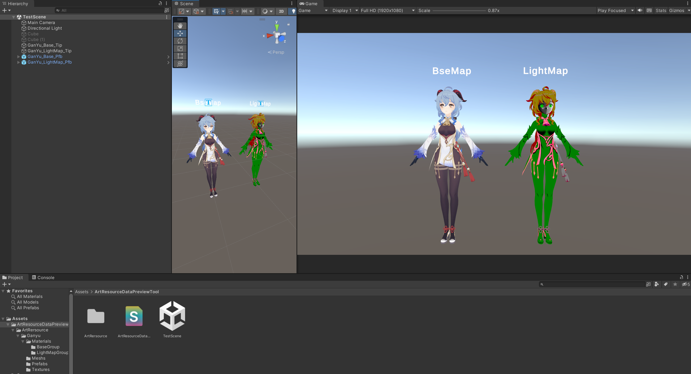
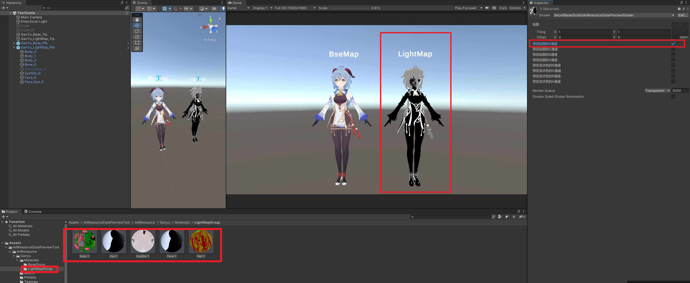
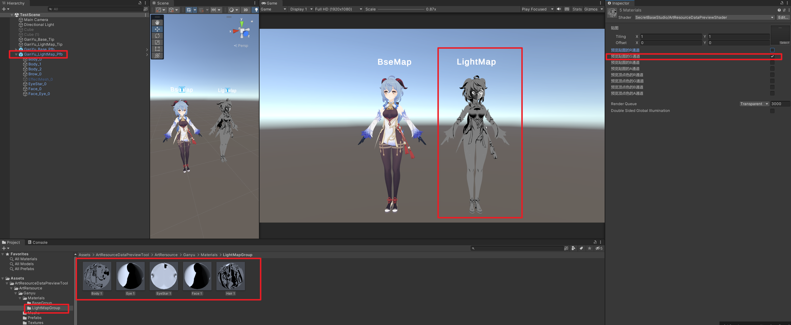
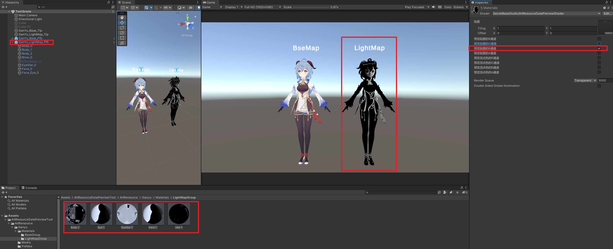

# URP|ArtResourceDataPreviewTool
美术资源数据预览工具

## 功能

方便美术查看在Unity里预览贴图通道和顶点色通道

## 开发者
秘密基地工作室(SecretBaseStudio)-6君

## 注
Unity版本：202.3.19f1
使用的URP
场景中的资源并没有顶点色，所以没有效果只会显示一片白色

场景中的资源仅供学习使用，请勿用于其他用途

## 如何使用
1.下载工程

2.打开工程

3.打开TestScene

4.场景中有美术资源，使用了可以预览贴图通道和顶点色通道的Shader

5.通过勾选开关可以实现预览当前通道在模型上的Mask信息（一次只能勾选一个选项）

6.所以你只需要替换掉你要预览的模型的Shader，在材质面板进行勾选即可预览通道值

